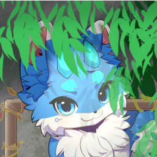

<!-- markdownlint-disable MD041 MD045 MD033 -->

| 锐冰龙    |
| :---: |
| **基本信息**   中文名： 锐冰龙   英文名：SharpIce   性别：男|
| **物种**   物种： Furry、神兽   生物：龙、鱼混种 |
| **其他**   属性：冰 |

# 概述

&ensp;&ensp;锐冰龙是卵生生物，在一次威胁中孵化并保护自己免受威胁。但对于这颗卵的来历仍然未知。

## 不同形态

### 第一形态 - Furry

&ensp;&ensp;这是锐冰龙在受到威胁后诞生时的形态。

### 第二形态 - Avali

&ensp;&ensp;这是锐冰龙在严重受伤且无人帮助的情况下重新变成了卵，并且在某一时间孵化诞生的形态。

# 外貌
